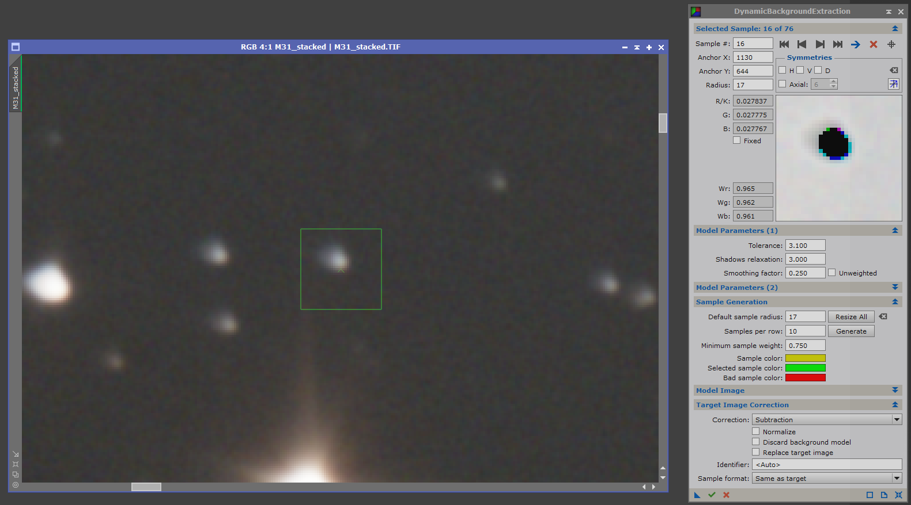

# Image Processing in PixInsight

Processing the Andromeda galaxy (Messier 31) using PixInsight.

## 1. Starting Image

### 1.1 Equipment
|||
|---------------------------|------------------------------------------------|
| Imaging telescope         | Robtics Newtonian 203/800 mm Robtics PN8F4 OTA |
| Imaging camera            | Canon EOS Ra (CMOS)                            |
| Mount                     | Equatorial Celestron Advanced VX AVX GoTo      |
| Guiding telescope / lens  | Robtics Lens                                   |
| Guiding camera            | ZWO Optical ASI-224MC (CMOS)                   |
| Imaging software/hardware | ZWO ASIAIR PLUS                                |

### 1.2 Frames
Frames acquired at ISO 800 using a binning of 1.

| Type    | Exposures | Integration time in seconds |
|---------|-----------|-----------------------------|
| Lights: | 140       | 30                          |
| Bias:   | 20        | 0.001                       |
| Dark:   | 20        | 30                          |
| Flats:  | 20        | 1.6                         |

### 1.3 Acquisition conditions
Weather forecast for Eindhoven in the Netherlands on the 27th of February in 2022 according to https://telescopius.com/weather. 

### 1.4 Preprocessing
The starting image of the Andromeda galaxy is stacked using all the acquired frames in DeepSkyStacker using default settings.
The resulting image is saved in the .TIF format and has dimensions of 6742x4498 pixels and has a size of 347 MB.
Opening up the image in windows photo viewer does not show much of the Andromeda galaxy...

This is because all the photons which have been captured of the Andromeda galaxy and surrounding stars are incredibly faint compared to the light pollution from the city and other imaging artifacts.

However, when we open up the image in PixInsight and by clicking on the `STF AutoStretch` button (highlighted in the right top corner of the image below), more detail of the Andromeda galaxy becomes visible.
This screen transfer function (STF) improves the visibility of the image as it is represented on the screen.
Allowing to show this detail without modifying its pixel data in any way.
This is useful for the image processing steps so we can see what we are doing :-).

> Link to the ScreenTransferFunction documentation: https://pixinsight.com/doc/tools/ScreenTransferFunction/ScreenTransferFunction.html

## 2. Processing steps

### 2.1. Cropping the image

The `DynamicCrop` process can be used to remove preprocessing or shooting artifacts such as image stacking residuals or heavy light pollution in corners by cropping the image to smaller dimensions.

The acquired frames had vignetting problems caused by the full-frame sensor and the optical path not being wide enough.
Below, an example Light frame with auto stretch applied is shown where the vignetting is clearly visible. 

Because of this vignetting problem, the stacking of the frames resulted in bad processing of the pixel data in the vignetting plagued pixels (especially in the corners of the image).

Largely due to the vignetting problem, the image was cropped to a width of 5600 pixels and a height of 3800 pixels.
The vignetting problem is mitigated by cropping it out of the image.
It is okay to do so, since there is enough space left in the image to contain the Andromeda galaxy. 

### 2.2. Extracting unwanted gradients

The `DynamicBackgroundExtraction` process is capable of identifying and removing unwanted gradients in the image caused by light pollution from cities and/or the moon.

In the `DynamicBackgroundExtraction` process window, start by clicking on the reset button in the lower right corner.
This will overlay two lines on the image forming a cross with four quadrants.
In the `Sample Generation` tab change the default sample radius to 17 and the samples per row to 10.
Then, click on the `Generate` button.
This will generate several markers on the image based on the tolerance set in the `Model Parameters (1)` tab.
If preferred, the sample color of the markers can be changed to a different color by clicking on the sample color and changing it to the preferred color.
Continue increasing the tolerance parameter and clicking on generate until a marker is present in all corners of the image. 

In the example image below, the sample color is changed to yellow and a tolerance of 3.1 is set to cover the whole image in markers.

After the image is covered in markers, move the markers away from any nebulosity of the galaxy or stars.
We want the markers to only cover the background sky of the image. 

This is a manual process of going through each marker using the `Selected Sample: x of X` tab using the arrows.
Zoom in on the image and click on the blue arrow to locate the current marker in the view.
if the marker is on a star, nebulosity, or shows any darker colored pixels in the small preview on the right, move the marker around until it does not cover a star or nebulosity and no dark pixels are present in the preview.

Upon completion of the process, the view might look similar to below.

When satisfied with the marker positions, change the `Correction` method to subtraction under the `Target Image Correction` tab since we want to subtract the unwanted gradient signals from the image.

> NOTE: 
> If we were using the full image with the vignetting included, the correction method should be division instead of subtraction to restore proper brightness levels to darker areas identified in the gradient. 
> However, due to the bad calibration from the flat frames, we opted for cropping it out instead. 

Then, click on the green execute checkmark in the left bottom corner of the window.
This will execute the background extraction process and create two views; one containing the subtracted gradients from the background and the other the image with the gradients subtracted.
Below, a comparison of before and after the dynamic background extraction process is shown.

This reveals even more detail in the Andromeda galaxy.

> Link to an in depth guide on DynamicBackgroundExtraction: https://jonrista.com/the-astrophotographers-guide/pixinsights/dynamicbackgroundextraction/

